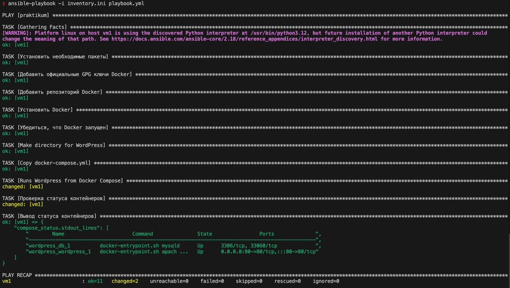
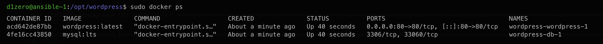
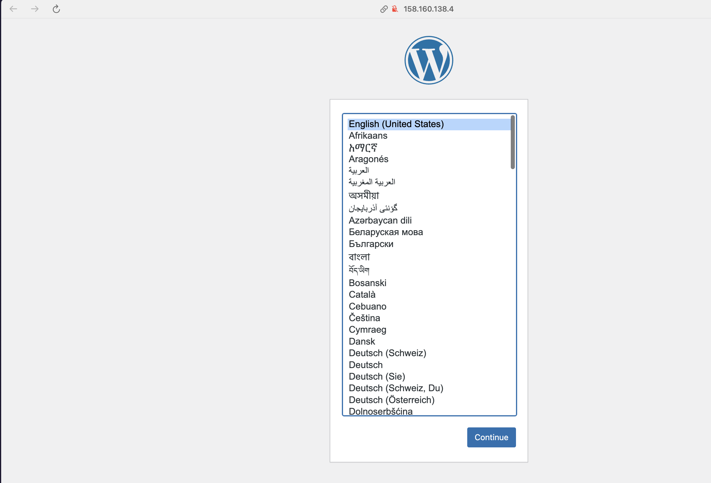

# ЛР №1: Развёртывание WordPress через Ansible

## Цель работы

Автоматизировать установку Docker и запуск приложения WordPress с базой данных MySQL в отдельных контейнерах на удалённой виртуальной машине с использованием Ansible.

---

## Структура проекта

```bash
inventory.ini             # Inventory-файл с описанием хостов и ключей
playbook.yml              # Основной playbook
files/
└── docker-compose.yml    # Compose-файл для запуска WordPress и MySQL
README.md                 # Описание проекта
```

## Результат работы

В результате работы на удалённой ВМ был установлен Docker, развёрнут Wordpress + MySQL  
#### Логи о выполнении

#### ```docker ps```

#### UI Wordpress на ip удалённой машины

